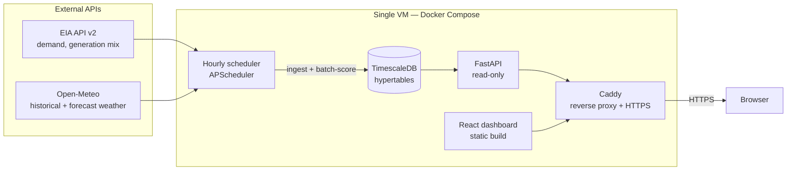

# Prometheus

A real-time electricity grid monitoring and stress-forecasting system for three U.S. grid
operators (CAISO, ERCOT, PJM). It ingests live demand, generation-mix, and weather data,
backtests three forecasting approaches against each other honestly, serves the winning model's
forecasts and stress alerts through a live API and dashboard, and — the point of the whole
exercise — tracks its own accuracy transparently instead of just asserting it.

**Live:** https://129.158.44.62.nip.io

## Problem

Grid operators publish their own day-ahead demand forecasts, but those forecasts aren't equally
good everywhere, and there's no public, ongoing scorecard comparing alternative approaches
region by region. This project builds that scorecard for three regions, using a real backtesting
methodology (not just live tracking from day one), and turns the winning forecast into
plain-language stress alerts — "why is this hour flagged," not just a red badge.

## Architecture



The scheduler is the only thing that ever writes to the database or calls an external API. The
FastAPI app only ever reads from Postgres — no model inference in the request path, so a forecast
being expensive to compute (LightGBM refit, Prophet's Stan sampler) never shows up as request
latency. See `NOTES.md` for why that split matters and what it cost to get right.

## Model comparison — real backtested numbers

Walk-forward validation, 90-day held-out window, 1–24h-ahead forecasts, weekly model refit
(see "Methodology" below for what that means and why).

| Region | Naive (168h) | Prophet | **LightGBM** | EIA's own forecast |
|---|---|---|---|---|
| CAISO | 6.84% | 6.17% | **2.94%** | 10.69% |
| ERCOT | 9.51% | 7.17% | 3.08% | **1.99%** |
| PJM | 8.64% | 7.82% | **2.80%** | 3.69% |

*(MAPE — mean absolute percentage error, lower is better)*

**LightGBM wins 2 of 3 regions — and loses to EIA's own forecast in ERCOT.** That's the honest
result, and it's a better story than a clean sweep would have been: it means the comparison is
real, not an artifact of picking a favorable region. It also resolves something Phase 2 flagged
as an open question — EIA's own forecast isn't universally weak, it's *CAISO-specific* (10.69%
there vs. 1.99% in ERCOT). A plausible explanation is that ERCOT runs a mature, well-resourced
internal forecasting operation as a single-state, tightly-coupled market — plausible, not
confirmed, and exactly the kind of claim this project tries not to overstate.

## Three genuine findings

1. **The regional split above.** LightGBM is not a universal win; which model to actually deploy
   is a per-region decision, and the system is built so that decision can be data-driven
   (`model_accuracy` is queried, not hardcoded) rather than asserted once and forgotten.
2. **A real historical stress event, correctly flagged.** Standing 24 hours before CAISO's actual
   September 2022 heat wave — a genuine, widely-reported near-rotating-outage event — using only
   data available at that point, the system fires a WARNING alert. The forecast itself
   under-predicted the true peak by about 13% (44,411 vs. 51,104 MWh actual), and the alert still
   fired correctly, because tail events are hard to forecast precisely but not hard to flag as
   "this is going to be unusually bad." Conflating forecast accuracy with alert usefulness would
   have been the wrong lesson to take from that gap.
3. **Feature importance as a pruning signal.** LightGBM's engineered `is_holiday` flag and
   `temperature²` term both scored *zero* importance. Gradient-boosted trees split on raw values
   and already capture nonlinear temperature response for free — the manually engineered
   quadratic term was redundant, not additive. That's a concrete, explainable result, not just a
   number to report.

## Methodology, briefly

- **Walk-forward validation**, not a random train/test split — the model only ever sees data
  from before the point it's asked to predict, sliding forward through a 90-day test window.
- **Weekly refit, not hourly** — Prophet and LightGBM are refit once a week and reused across
  daily forecast origins in between, matching how these models are actually deployed (periodic
  retrain, continuous serving), not an unrealistic and expensive "retrain before every forecast."
- **Direct multi-horizon forecasting, not recursive** — one LightGBM model produces the entire
  24-hour forecast curve per origin, with `hours_ahead` itself as a feature, rather than chaining
  24 one-step predictions and compounding their errors.
- **Known limitation:** the backtest feeds each model the *actual* historical temperature for the
  forecast window, i.e. it assumes a perfect weather forecast. Live scoring instead uses a real
  forward-looking weather forecast (Open-Meteo), but the backtested accuracy numbers above are
  measured under the perfect-foresight assumption and should be read with that caveat — real
  deployed accuracy will be somewhat lower. See `NOTES.md` for the full reasoning.

Full phase-by-phase build log — every design decision, bug found, and what I learned from each —
is in [`NOTES.md`](NOTES.md).

## What I'd do with more time

- Source a real historical forecast-vs-actual weather dataset to remove the perfect-foresight
  assumption from backtesting, not just from live scoring.
- Hyperparameter-tune LightGBM via proper time-series cross-validation (current parameters are
  reasonable defaults, not tuned).
- Integrate EIA-860 generator capacity data for a literal "% of capacity" stress framing, instead
  of the current historical-percentile proxy.
- Weight `find_similar_historical_event`'s matching by day-of-year proximity in addition to
  temperature, so comparisons don't cross seasons as readily.
- Add a fourth region to further test whether the model comparison story generalizes.

## Technical debt, honestly

- Perfect-foresight temperature in backtesting (above) is the biggest gap between reported and
  realistically-achievable accuracy.
- No hyperparameter tuning on LightGBM.
- PJM's single weather coordinate is a much rougher approximation than CAISO/ERCOT's, given how
  much larger and more geographically diverse PJM's footprint is.
- No API caching or rate-limiting — fine at this traffic scale, not fine at real scale.
- Only LightGBM's forecast is stored/served live; naive/Prophet exist only in the backtest
  record, which is sufficient for the accuracy comparison but means there's no live A/B of
  serving forecasts.

## Local setup

1. Copy `.env.example` to `.env` and set `EIA_API_KEY` (free, instant — register at
   https://www.eia.gov/opendata/register.php).
2. Start the database: `docker compose up -d`
3. Create a virtualenv and install dependencies:
   ```
   python3 -m venv .venv
   .venv/bin/pip install -r requirements.txt
   ```
4. From `backend/`, backfill historical data for each region:
   ```
   cd backend
   ../.venv/bin/python -m app.ingestion.backfill --region CISO --start 2019-01-01
   ../.venv/bin/python -m app.ingestion.backfill --region ERCO --start 2019-01-01
   ../.venv/bin/python -m app.ingestion.backfill --region PJM --start 2019-01-01
   ```
5. Backtest the models and store accuracy results (needed for the `/accuracy` endpoint):
   ```
   ../.venv/bin/python -m app.forecasting.run_backtest --region CISO
   ```
6. Run the hourly ingestion + forecast/alert scoring scheduler:
   ```
   ../.venv/bin/python -m app.ingestion.scheduler
   ```
7. Run the API:
   ```
   ../.venv/bin/uvicorn app.api.main:app --reload --port 8000
   ```
   Endpoints: `/regions`, `/{region}/current`, `/{region}/generation-mix`,
   `/{region}/forecast`, `/{region}/accuracy`, `/{region}/alerts`,
   `/{region}/predictions-history`. Interactive docs at `/docs`.
8. Frontend: `cd frontend && npm install && npm run dev`.

## Production deployment

See `docker-compose.prod.yml` and `Caddyfile` — same services, plus a Caddy reverse proxy
serving the built frontend and proxying `/api/*` to FastAPI over one HTTPS domain (so there's no
CORS in production, only in local dev). Deployment steps and the live URL are in `NOTES.md`.

## Architecture notes

- **Data sources:** EIA API v2 (hourly demand, day-ahead demand forecast, and generation mix by
  fuel type, per balancing authority) and Open-Meteo (free, keyless historical + forecast
  weather).
- **Storage:** TimescaleDB (Postgres + hypertables).
- **Regions:** `backend/app/regions.py` is a small registry — CAISO, ERCOT, and PJM are live;
  adding a fourth is a config entry, not new ingestion code (verified in Phase 4, which also
  found and fixed a gap where that claim wasn't actually true yet).
- **Forecasting:** naive seasonal baseline, Prophet, and LightGBM (with engineered features), all
  backtested through one shared walk-forward harness. LightGBM is the production model, except
  where the data says otherwise (see ERCOT above).
- **Serving:** the hourly scheduler batch-scores forecasts and alerts into Postgres; the FastAPI
  app only ever reads from the database.
